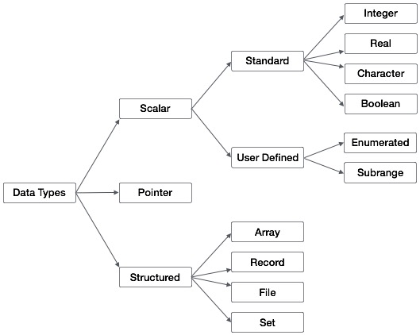

# 基礎資料類型-純量

</br></br>
以下為與 python 所對應的基礎資料類型

| Python  | Pascal     | C++                    | Description                                                      |
| ------- | ---------- | ---------------------- | ---------------------------------------------------------------- |
| `int`   | `integer`  | `int`                  | Integer type                                                     |
| `float` | `real`     | `float`, `double`      | Floating-point type                                              |
| `str`   | `char`     | `char`                 | Single character                                                 |
| `str`   | `string`   | `std::string`, `char*` | String                                                           |
| `bool`  | `boolean`  | `bool`                 | Boolean value                                                    |
| `int`   | `byte`     | `unsigned char`        | Integer (values between 0 and 255)                               |
| `int`   | `shortint` | `short`                | Small-range integer (range depends on system, often -128 to 127) |
| `int`   | `longint`  | `long`, `long long`    | Long integer                                                     |
| `float` | `single`   | `float`                | Single precision floating-point                                  |
| `float` | `double`   | `double`               | Double precision floating-point                                  |
| `float` | `extended` | `long double`          | Extended precision floating-point                                |
| `int`   | `comp`     | `long long`, `int64_t` | Large integer (complement form)                                  |
| `float` | `currency` | `-`                    | Currency type                                                    |

##### 說明

-   `integer` 範圍恆等於 `longint` 其範圍為 `-2,147,483,648 ~ 2,147,483,647`。
-   `real` 範圍恆等於 `double`。
-   `string` 在 `C` 語言當中是不存在的類型，**其結構主要是 `char` 類型的一維陣列**，主要是讓 `Pascal` 較為簡單而內建該類型。使用的方式需要用單引號`'`做包夾，在其他語言 `char` 與 `string` 會有不同，但 `Pascal` 內統一只用 `'`。
-   `extended`、`comp` 與`currency` 應用的場合較為極端偏向資料科學與財務。

## 宣告與賦值的方式

### 宣告

宣告必須在 `begin` 之前，不論是在 `procedure` 、 `function` 或 `全域`，如下範例。

#### `全域`

```pascal
program HelloWorld;
var
    variable :   integer;
begin
    writeln('Hello, World!');
end.
```

#### `function`

```pascal
function cal(a ,b :integer):   integer;
var
    c :   integer =   3;
begin
    cal := a+b +c;
end;
```

#### `procedure`

```pascal
procedure say(s:string);
var
    space:   string =   ' ';
begin
    writeln(s+space +'world');
end;
```

### 賦值

賦值可以有兩種方式賦值，在`宣告的時候就設置預設值`，或是`在要使用的時候才賦值(非預設)`，兩者差異在於預設的時候不可用 `:=` 要用 `=` ，範例如下：

#### `預設值`

```pascal
program HelloWorld;
var
    variable :   longint =   2147483647;
begin
    writeln(variable);
end.
```

#### `非預設`

```pascal
program HelloWorld;
var
    variable :   integer;
begin
    variable := 2147483647;
    writeln(variable);
end.
```
