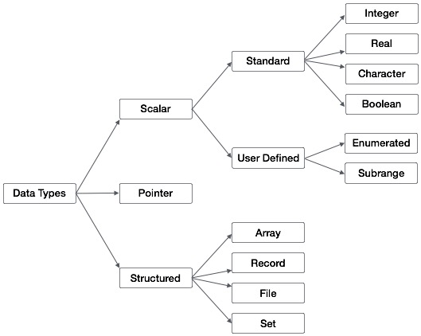

# 基礎資料類型-結構化



前一節所述的 `string` 若真要論歸類應該歸類為結構化類型，原因如同前一節所述**其結構主要是 `char` 類型的一維陣列**，然而除了陣列之外尚有其他類型，如 `recode`、`file` 與 `set`

## array(陣列)

`Pascal` 的陣列起始索引值是不固定的 可以是 `0` 或 `1` 端看需求而定，假設從 **0 ~ 5** 這樣會有 `6` 個元素，因此在進行陣列長度設置若假設從 `0` 開始則使用的長度需要 `-1`，意即：

```pascal
program HelloWorld;

var
    a :   array[0..5] of integer;
    i:   integer;
begin
    for i:= 0 to length(a)-1 do
        begin
            a[i] := i+1;
        end;

    for i := 0 to length(a)-1 do
        begin
            writeln(a[i]);
        end;
end.
```

## record(紀錄)

`Pascal` 的 `Record` 相當於 `C` 的 `struct` 或是 `Python` 的 `class`(僅資料持有的部分)，使用的方式如下：

```pascal
program RecordExample;

type
    tperson =   record
        name:   string;
        age:   integer;
    end;

var
    person :   tperson;
begin
    person.name := 'luke';
    person.age := 33;
    writeln(person.name);
    writeln(person.age);
end.
```

結構體並非物件，在進行定義並宣告之後不用實例化就可以直接使用。

## file(檔案)

該類型相當於檔案讀取寫入的控制物件，本教學暫不涉及該部分。

## set

該類型與 `Python` 的 `Set` 有點相同，主要是在編譯時間就固定的不重複相同類型的數值組。但該部分對於教學的使用部分較少，後續有需再在進行額外補充。
