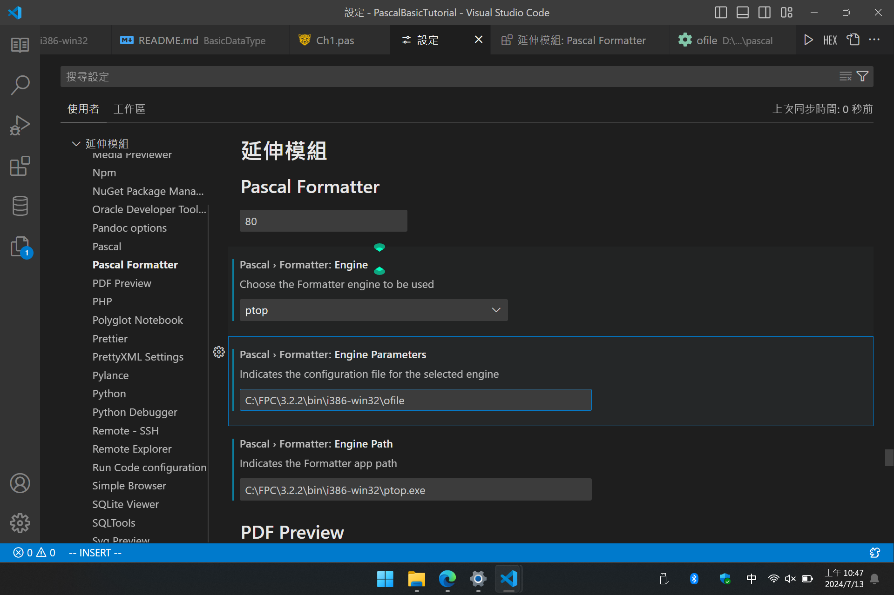

# 環境設定

本教學基於讀者學過 `Python` 為前提進行撰寫，因此內容部分大多數都會以對應的方式進行引導。使用的環境清單如下：

> [Visual Studio Code](https://code.visualstudio.com/)(以下簡稱 `VSCode`)
> [FreePascal](https://www.freepascal.org/)(程式碼編譯的基底，以下簡稱 `FPC`)
> [TDM-GCC](https://jmeubank.github.io/tdm-gcc/)(因 `FPC` 內建的 `GDB` 無法與 `VSCode` 終端機做整合，因此使用此軟體的 `GDB` 來進行偵錯)

除上述的基礎程式之外尚須加上部分 `Pascal` 與 `VSCode` 所整合的套件清單

> [Pascal](https://marketplace.visualstudio.com/items?itemName=alefragnani.pascal) > [Pascal Formatter](https://marketplace.visualstudio.com/items?itemName=alefragnani.pascal-formatter) > [Pascal Language Basics](https://marketplace.visualstudio.com/items?itemName=AnsonYeung.pascal-language-basics)

每個章節所需要的 `VSCode` 設定檔 `launch.json` 與 `tasks.json` 分別如下：

`launch.json`

```Json
{
    "version": "0.2.0",
    "configurations": [
        {
            "name": "Free Pascal Debug Launch(gdb)",
            "type": "cppdbg",
            "request": "launch",
            "program": "${workspaceFolder}\\main.exe",  // 當專案的相對路徑，程式起始名稱{main}
            "args": [],
            "stopAtEntry": false,
            "cwd": "${workspaceFolder}",
            "externalConsole": false,
            "MIMode": "gdb",
            "miDebuggerPath": "C:\\TDM-GCC-64\\bin\\gdb.exe", // 安裝的 gdb 位置
            "setupCommands": [
                {
                    "description": "Enable pretty-printing for gdb",
                    "text": "-enable-pretty-printing",
                    "ignoreFailures": true
                }
            ],
            "preLaunchTask": "Free Pascal Debug"
        }
    ]
}
```

`tasks.json`

```Json
{
    "version": "2.0.0",
    "tasks": [
        {
            "label": "Free Pascal Debug",
            "type": "shell",
            "command": "fpc",
            "args": ["-g", "${workspaceFolder}\\main.pas"], // 前面的 -g 表示進行偵錯編譯, 後方的路徑為要編譯檔案的相對位置
            "group": {
                "kind": "build",
                "isDefault": false
            },
            "presentation": {
                "echo": true,
                "reveal": "always",
                "focus": false,
                "panel": "shared",
                "showReuseMessage": true,
                "clear": false
            }
        }
    ]
}
```

除了上述的設定之外考量到可讀性的部分，建議暫時統一使用以下方連結的`設定值`，並將該設定值以 `ofile` 命名並放置在 `FPC` 的 `bin\i386-win32` 資料夾內，如後方的示圖。

[ofile 檔案內容連結](./ofile)



Pascal 本身並`沒有大小寫敏感`的概念，因此 `Ab` `ab` `AB` 是屬於相同的`標示符`，然而針對可讀性而言大多數會選擇用`大駝峰`(Upper Camel Case) 、 `小駝峰`(Lower Camel Case)、`蛇行命名法`(Snake Case)或`匈牙利命名法`(Hungarian notation)，本篇主要以 **`小駝峰`** 命名法為主，後續有和規範端看團隊而定。

-   [駝峰式大小寫](https://zh.wikipedia.org/zh-tw/%E9%A7%9D%E5%B3%B0%E5%BC%8F%E5%A4%A7%E5%B0%8F%E5%AF%AB)
-   [蛇行命名法](https://zh.wikipedia.org/wiki/%E8%9B%87%E5%BD%A2%E5%91%BD%E5%90%8D%E6%B3%95)
-   [匈牙利命名法](https://zh.wikipedia.org/wiki/%E5%8C%88%E7%89%99%E5%88%A9%E5%91%BD%E5%90%8D%E6%B3%95)
